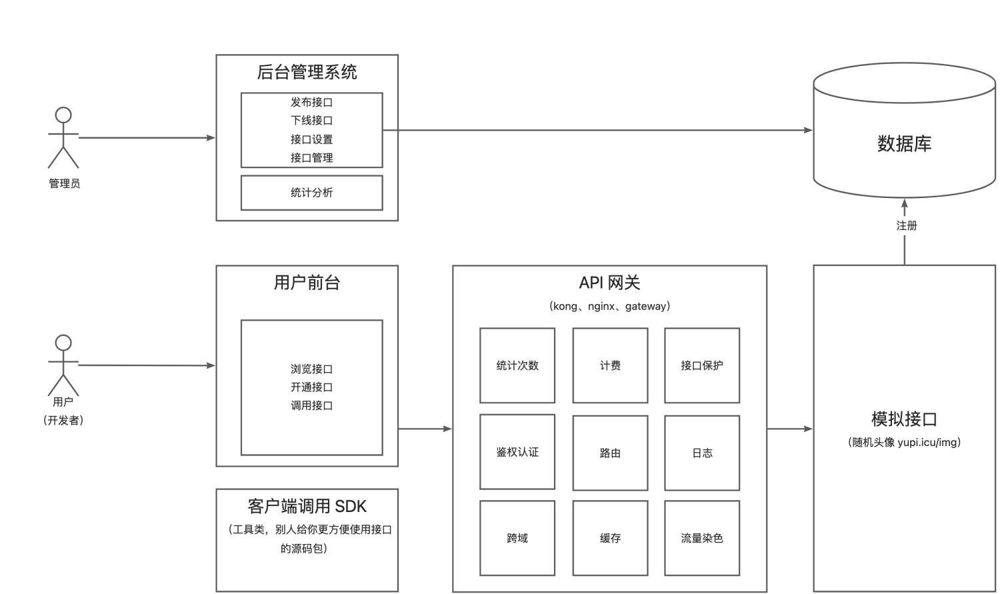
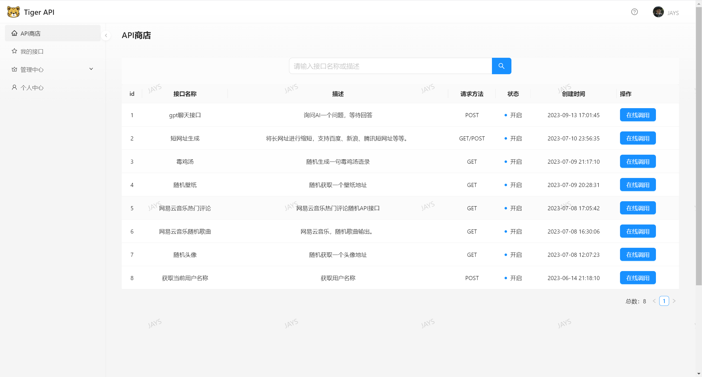
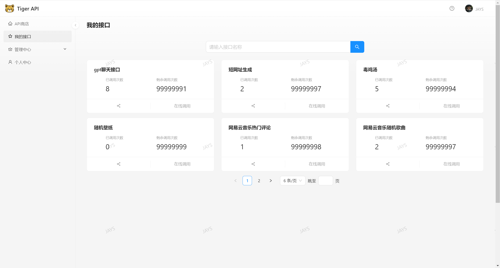
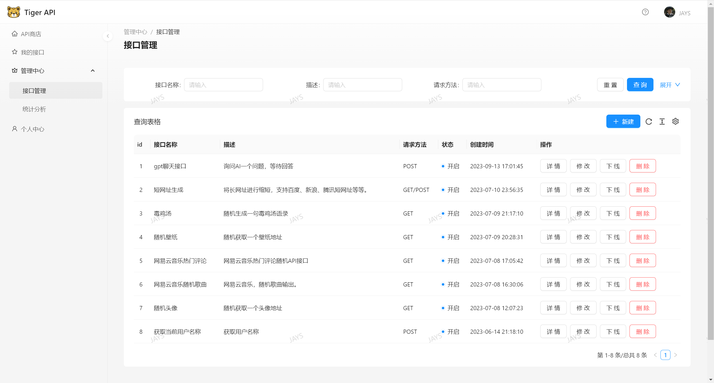
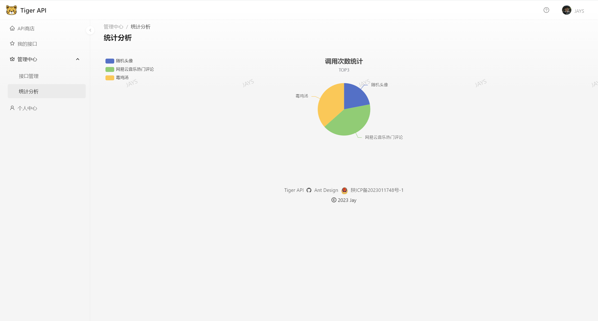
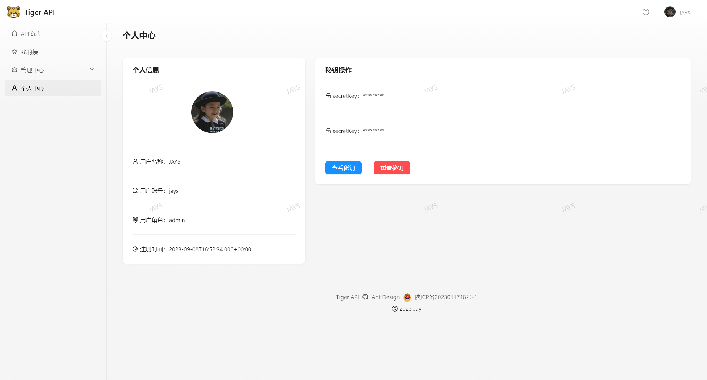

# jay-api-frontend

## 项目介绍
这是一个提供API接口供开发者调用的平台前端代码仓库。管理员可以接入并发布接口、统计分析各个接口调用情况；用户可以登录、注册，开通接口调用权限、浏览接口、在线调试，还可以使用客户端SDK轻松在代码中调用接口。

## 项目架构图

## 技术选型

- Ant Design Pro 5.x脚手架
- React
- Ant Design Procomponents组件库
- Umi 
- Umi Request（Axios的封装）
- OpenAPI前端代码生成

## 启动前端项目

`yarn install`

`yarn start`

前端使用Ant Design Pro，如果启动失败请参看[官方文档](https://pro.ant.design/zh-CN/docs/getting-started/)

## 项目预览

注册登录首页

API商店

我的接口

接口管理

接口调用次数统计分析

个人中心

